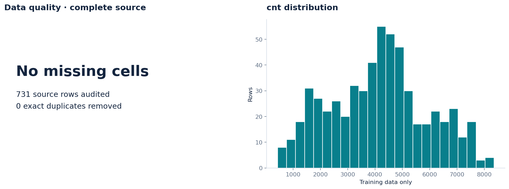
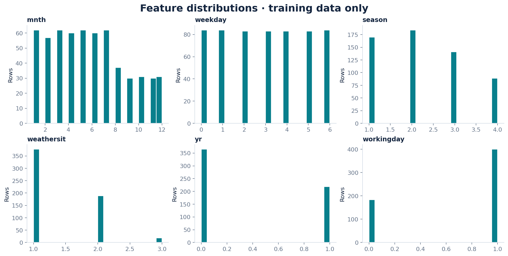
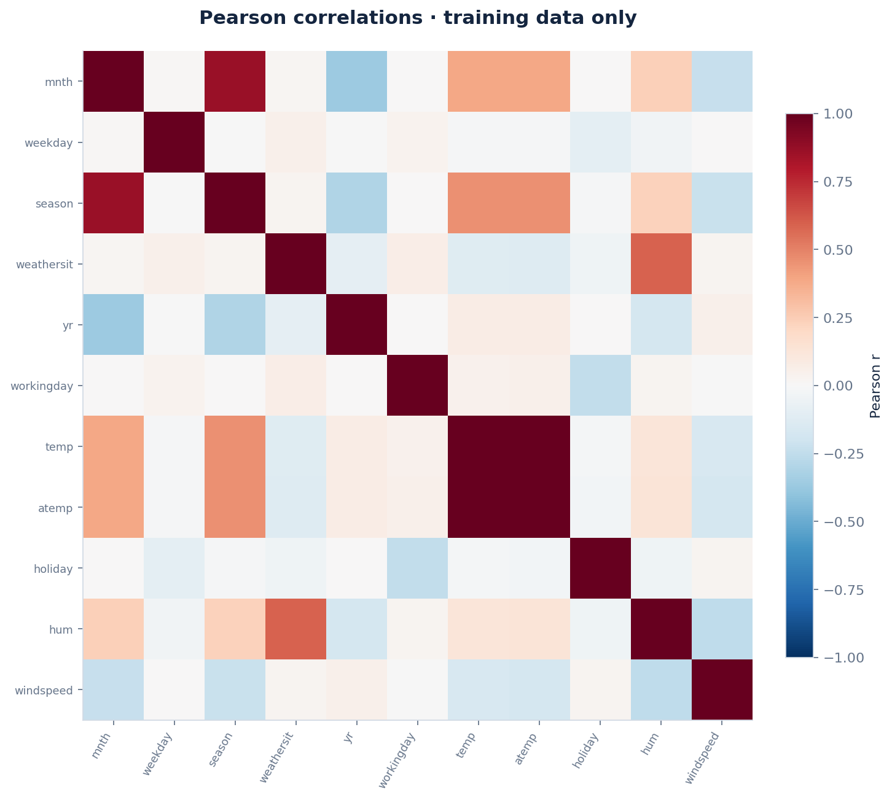
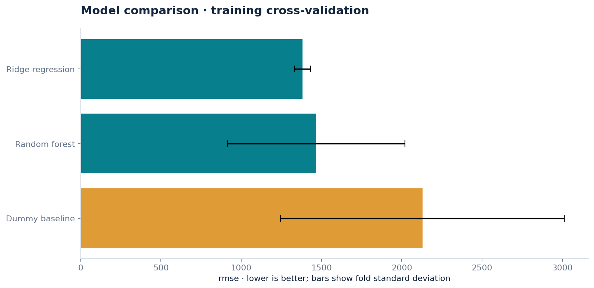
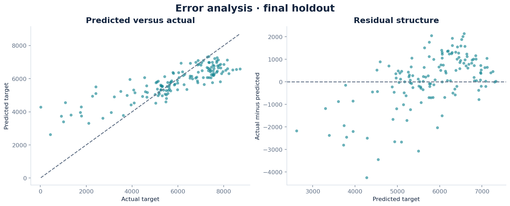
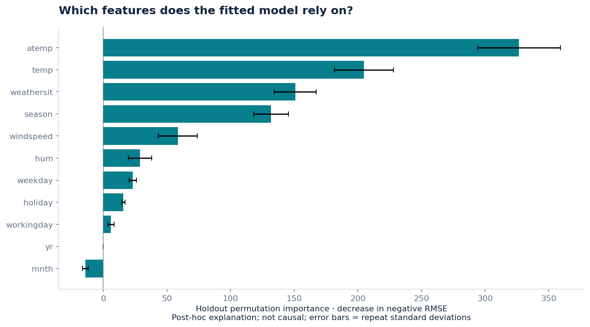
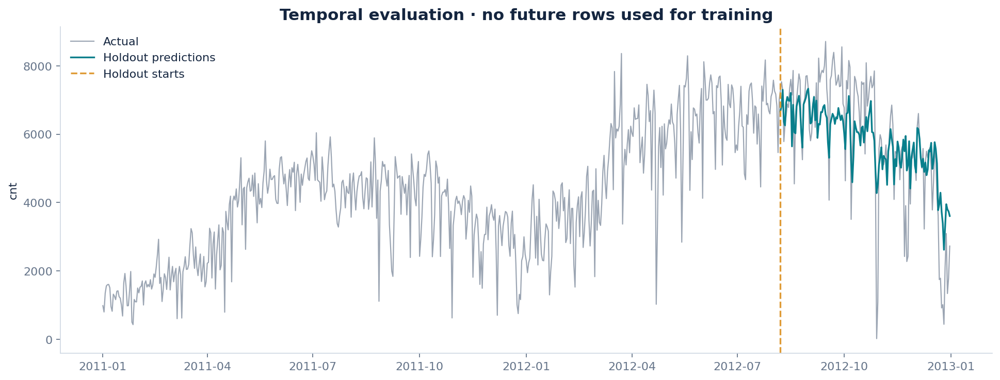

# Predicting daily bike demand over time

**2026-09-05 · REGRESSION · Automatically executed · Human review pending**

## Research question

Can calendar and observed weather variables estimate demand in a later time period?

## Results

Ridge regression was selected using training cross-validation. Its holdout rmse was 1165.6547, versus 2560.5558 for the dummy baseline; it improved on that baseline on this holdout.

Training rmse was 800.9383. The training/holdout difference is descriptive; it is not an independent estimate of model uncertainty.

atemp had the largest mean permutation score drop (326.6879). This measures the fitted model's reliance on a feature, not a causal effect; correlated features can share importance.

The largest holdout absolute error was 4255.6062 target units. Error examples are retained in error_analysis.csv.

The strongest absolute Pearson feature correlation in the training data was temp / atemp (|r| = 0.997); this suggests checking redundancy, not concluding causality.

## Evaluation design

Chronological holdout; expanding-window CV with a 7-row gap. Training rows: 584; final holdout: 147. Seed: 42.

Missing-value imputation, scaling and category encoding are fitted inside each CV training fold. Model selection uses training CV only. The frozen winner and dummy baseline are then scored on the holdout. The baseline is allowed to win.

### Training cross-validation

| Model | rmse | Fold SD |
| --- | --- | --- |
| Ridge regression | 1381.5606 | 50.2563 |
| Random forest | 1465.8117 | 552.7433 |
| Dummy baseline | 2128.3046 | 882.8080 |

Fold standard deviations are descriptive spread, not confidence intervals. The best CV score is selection-optimistic.

### Final holdout

| Model | Metric | Value |
| --- | --- | --- |
| Ridge regression | rmse | 1165.6547 |
| Ridge regression | mae | 870.6685 |
| Ridge regression | r2 | 0.6134 |
| Dummy baseline | rmse | 2560.5558 |
| Dummy baseline | mae | 2290.4127 |
| Dummy baseline | r2 | -0.8657 |

IID bootstrap omitted because serial dependence requires a reviewed block-bootstrap design.

## Data provenance

Source: [https://archive.ics.uci.edu/dataset/275/bike+sharing+dataset](https://archive.ics.uci.edu/dataset/275/bike+sharing+dataset)

License: CC BY 4.0. Attribution and source description are in SOURCE.md. The exact analyzed snapshot and its SHA-256 are retained.

## Data quality

| Check | Value |
| --- | --- |
| original rows | 731 |
| original features | 15 |
| missing cells | 0 |
| missing target rows removed | 0 |
| exact duplicates removed | 0 |
| usable rows | 731 |

Excluded from predictors: instant, casual, registered, dteday. See data_dictionary.csv for column types, missingness and uniqueness.

## Visual evidence



Missing values and target distribution.



Numeric feature distributions; up to six features by training/sample variance.



Feature associations; correlation does not imply causation.



Candidate model comparison; error bars are fold standard deviations, not confidence intervals.



Regression predictions and residuals on the holdout.



Permutation feature importance of the selected model.



Chronological holdout and predictions.

## Limitations

Observed same-day weather may be unavailable at forecast time, so this is a retrospective conditional demand estimate. The final chronological holdout crosses seasons and can expose distribution shift. Casual and registered counts are excluded because they sum to the target.

The automated pipeline cannot infer all leakage paths, sampling bias, entity grouping or business meaning. Feature importance is post-hoc and is not used to choose the winner. Any follow-up tuned after inspecting this holdout needs a fresh final evaluation.

## Reproduce

From the repository root, install requirements.txt and run:

```bash
python daily_ds/reproduce.py projects/2026-09-05-bike-demand
```

The command uses the saved snapshot, configuration and dataset specification, and writes to reproduced/. analysis.ipynb provides a readable walkthrough. Numeric results may differ slightly across platforms; software versions and code hashes are recorded.

## Your contribution

This study was generated and executed by an automated agent. It has not been reviewed by Saud. Use LEARNING_NOTES.md to record your own explanation, changed code, new experiment and measured outcome; leave unanswered fields blank.
